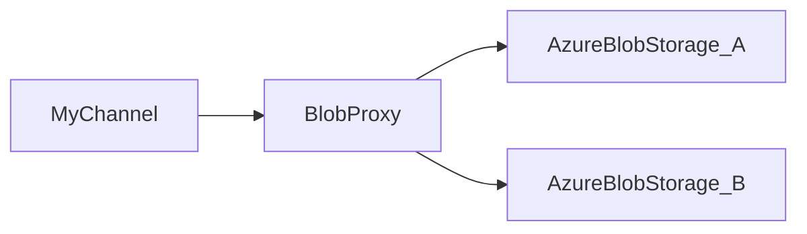

# blob_proxy
Blob Proxy is simple web server to be used as a proxy for azure blob storage services. It can be used to serve private content from blob storage services without making the content public.

BlobProxy can control access with a simple token based authentication mechanism. It can also be used to serve content from multiple blob storage accounts.