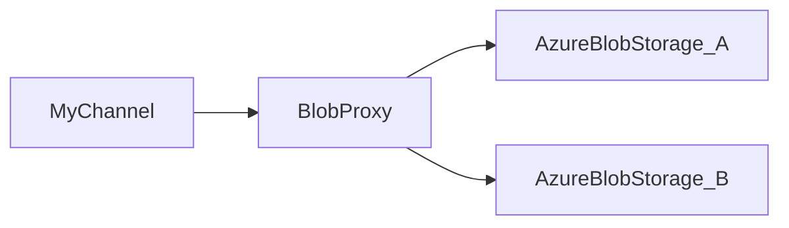

# blob_proxy
Blob Proxy is simple web server to be used as a proxy for azure blob storage services. It can be used to serve private content from blob storage services without making the content public.



BlobProxy can control access with a simple token based authentication mechanism. It can also be used to serve content from multiple blob storage accounts.

## Usage
```bash
STORAGE_ACCOUNT="xxx" 
STORAGE_ACCESS_KEY="yyyy"  
RUST_LOG=info cargo run --bin blob_proxy --features=blob_proxy
```
**STORAGE_ACCOUNT** is the name of the storage account and **STORAGE_ACCESS_KEY** is the access key for the storage account. 

## Test 
```bash 
curl -v  -O --limit-rate 1M  http://localhost:8888/testdata/temp_5GB_file.dat --progress-bar
```
